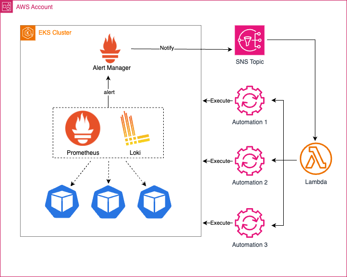

# SSM Automation Trigger [Under Construction]

SSM Automation trigger receives alerts from EKS cluster(s) and executes the appropriate SSM automation to analyze/remediate issues.

## Architecture


## Setup Instructions

1. Deploy AWS SAM template to create the S3 Bucket, Lambda function, SNS Topic, and related components
```
sam build --use-container
sam deploy --guided
```
```
# Set the SNS Topic created in the above step as an environment variable
export SNS_TOPIC_ARN=<topic-arn-from-sam-deploy-output>
```

2. Create an EKS Cluster
```
export CLUSTER_NAME=ssm-automation-trigger
export REGION=us-east-1
export AWS_ACCOUNT_ID=1234567890
eksctl create cluster --name ${CLUSTER_NAME} --region ${REGION}
```

3. Create an IRSA role for the alertmanager pod to perform AWS actions
```
cat <<EOF > alertmanager-sns-policy.json
{
    "Version": "2012-10-17",
    "Statement": [
        {
            "Sid": "VisualEditor0",
            "Effect": "Allow",
            "Action": [
                "sns:Publish"
            ],
            "Resource":"*"
        }
    ]
}
EOF

aws iam create-policy --policy-name AlertManagerSNSPolicy --policy-document file://alertmanager-sns-policy.json --region ${REGION}

rm alertmanager-sns-policy.json
```


```
eksctl utils associate-iam-oidc-provider --region=${REGION} --cluster=${CLUSTER_NAME} --approve
```

```
eksctl create iamserviceaccount \
    --cluster=${CLUSTER_NAME} \
    --namespace=prometheus \
    --name=alertmanager \
    --role-name AlertManagerSNSRole \
    --attach-policy-arn=arn:aws:iam::${AWS_ACCOUNT_ID}:policy/AlertManagerSNSPolicy \
    --region=${REGION} \
    --approve
```

4. Deploy the kube-prometheus-stack helm chart
```
helm repo add prometheus-community https://prometheus-community.github.io/helm-charts
helm repo update
envsubst < prometheus/kube-prometheus-stack-values.yaml.tmp > prometheus/kube-prometheus-stack-values.yaml
helm upgrade --install prometheus prometheus-community/kube-prometheus-stack -n prometheus --values ./prometheus/kube-prometheus-stack-values.yaml
```

5. Provide EKS read-only access to the Lambda IAM Role

```
export SSMTriggerFunctionIAMRole=<iam-role-arn-of-SSMTriggerFunctionIAMRole-from-sam-deploy-output>
```
```
aws eks create-access-entry --cluster-name ${CLUSTER_NAME} \
    --principal-arn ${SSMTriggerFunctionIAMRole} \
    --username ssm-automation-trigger

aws eks associate-access-policy --cluster-name ${CLUSTER_NAME} \
    --principal-arn ${SSMTriggerFunctionIAMRole} \
    --access-scope type=cluster \
    --policy-arn arn:aws:eks::aws:cluster-access-policy/AmazonEKSViewPolicy
```

6. Test the lambda code locally
```
# For testing individual node not-ready workflow
sam local invoke --event events/kube-not-ready.json
```
```
# For testing 5 or more nodes in not-ready workflow
sam local invoke --event events/kube-not-ready-gt-5.json
```